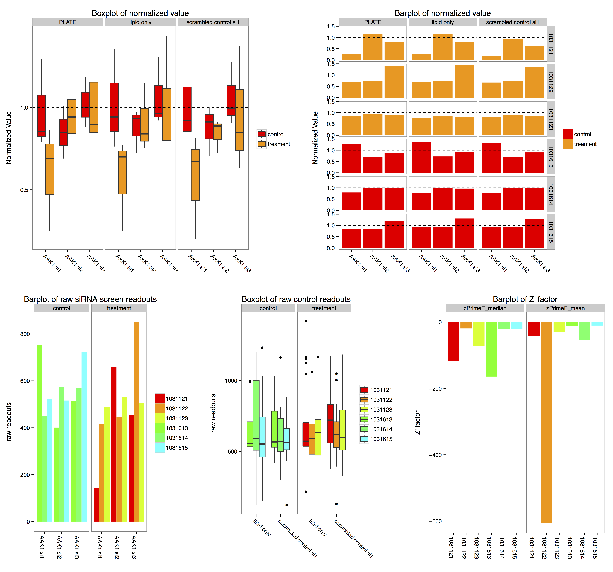

**Package**: **sylsnet** <br />
**Authors**: `r packageDescription("synlet")[["Author"]] `<br />
**Compiled**: `r Sys.Date()`

# Introduction
Here is a step-by-step tutorial of the package **synlet**. This package processes data from cellBasedArrays.
In this vignette, we will show a quick tour of using the synlet with dummy/stimulated
data, including quality control, data visualization, and most importantly, hits selection.

# Load the package and data.
First, Let's have a look at the example data.
```{r load_data}
library(synlet)
data(example_dt)
head(example_dt)
```

The **example_dt** is a data.table containing 8 columns, all of them are mandatory and please do **NOT** change the column names.
Besides that, users are free to add new columns. However, please not that the new columns may not appear in the final results. Users need to generate **example_dt** like data.table from the screen results.

In the **example_dt**:

+ *PLATE*, the name of individual plate. Must be **character** value.

+ *MASTER_PLATE*, usually there are plate replicates designed in the RNAi screen experiments. Several individual *PLATE* having the identical layout are group to a *MASTER_PLATE*.

+ *WELL_CONTENT_NAME*, the name of siRNA used in each cell, in the format of "geneName si(number)", as usually several siRNAs are available to control for the off-target effect.

+ *EXPERIMENT_TYPE*, indicates the cells are sample (interested knock-down), or negative control (control_negative), or positive control (control_positive).

+ *EXPERIMENT_MODIFICATION*, there are two conditions in synthetic lethal RNAi screen, named **treatment** and **control**.

+ *ROW_NAME* and *COL_NAME*, the position of siRNA reagent in the plate.

+ *READOUT*, the output of RNAi screen output for each cell in the plate. Here the data are randomized.

The **example_dt** contains three *MASTER_PLATE*, each *MASTER_PLATE* has three plates for **treatment** and **control**.


# Quality control
## Z and Z' factor
Z' factor and Z factor are widely used quality metrics in RNAi experiments.

Z' factor = 1- 3*($\delta_p$ + $\delta_n$) / |$\mu_p$ - $\mu_n$|

Z factor = 1- 3*($\delta_s$ + $\delta_n$) / |$\mu_s$ - $\mu_n$|

In Z' factor calculation, $\delta_p$, $\delta_n$, $\mu_p$, $\mu_n$ are the standard deviation and mean of positive control and negative control signal, respectively; while in Z factor formular $\delta_s$, $\delta_n$, $\mu_s$, $\mu_n$ are standard deviation and mean of samples and negative control signal, respectively. From the definition, we could see that Z' factor measures the quality of optimization of plates, and Z factor accesses the performance of screen on actual samples. Generally, the plates with value >= 0.5 are considered as excellent assay. See [1] and [2] for more information and discussion.

By default $\mu$ in the denominator are mean value of signals, *zFactor* function offers the option to use median instead, which could be more robust in certain conditions.

Here is an example, we specify negative control is "scrambled control si1", and positive control is "PLK1 si1". These informations are stored in *EXPERIMENT_TYPE* column.

```{r zFactor}
res <- zFactor(example_dt, negativeCon = "scrambled control si1", positiveCon = "PLK1 si1")
head(res)
```
As the *READOUT* are shuffled data, not surprising the Z and Z' factor are negative value.

## Heatmap of screen data
Synlet could plot the screen results in the format of heatmap, in which a dot represents a single cell. All plates are organized together in single figure. This provides a general view of RNAi screen quality.

```{r heatmap}
plateHeatmap(example_dt)
```

## Scatter plot of screen data
Usually in each plate there are negative and positive control siRNAs, which set the bound of siRNA effect. The scatter plot provide a direct way to examine the bound of controls. It is possible to specify multiple positive / negative controls in the function *scatterPlot*, and the output of all plates are arranged in a single plot.

```{r}
scatterPlot(example_dt, controlOnly = FALSE, control_name = c("PLK1 si1", "scrambled control si1", "lipid only"))
```
## Knock-down effect
It is often intuitive to look at the knock-down effect of a single gene in RNAi screen experiments. The function *siRNAPlot* plot the normalized and raw signals, the positive and negative control signals, and Z' factor of plates into a single graph. *siRNAPlot* provides the option to specify control siRNAs and normalization methods. The following codes show the knock-down effect of "AAK1".

We need to calculate the Z' factor based on mean and median of signals. By default, a pdf file named "AAK1.pdf" will be generated in the working directory, the return value contains all subplot and could be plotted separately.


```{r ZPrime}
zF_mean <- zFactor(example_dt, negativeCon = "scrambled control si1", positiveCon = "PLK1 si1")
zF_med <- zFactor(example_dt, negativeCon = "scrambled control si1", positiveCon = "PLK1 si1", useMean = FALSE)
```

```{r genePlot}
p01 <- siRNAPlot("AAK1", example_dt,
                  controlsiRNA = c("lipid only", "scrambled control si1"),
                  FILEPATH = ".",  zPrimeMed = zF_med, zPrimeMean = zF_mean,
                  treatment = "treatment", control = "control",
                  normMethod = c("PLATE", "lipid only", "scrambled control si1"))
```


# Hits selection
The main goal of synthetic lethal RNAi screen experiments is to identify interesting genes led to reliable difference in mortality between treatment and control plates, which is a difficult task because of cell heterogeneity, reagent efficiency and intrinsic character of genes. *Synlet* tries to improve the results of hits selection by employing several algorithms that explore data from different directions, including student’s t-test, median ± k median absolute deviation, rank products and redundant siRNA activity (RSA).

## Student's t-test
Student’s t-test is commonly used to test whether the mean from two samples are identical, thus it could be a helpful strategy in identifying synthetic lethal genes [3]. *Synlet* applies t-test to robust B-score value calculated from raw data of each plates, and the BH method is used to correct for the multiple comparisons.

We start with B-score calculation.

```{r bscore}
bscore_res <- sapply(unique(example_dt$MASTER_PLATE)[1], bScore, example_dt, treatment = "treatment", control = "control", simplify = FALSE)
head(bscore_res$P001)
```
*bscore_res* is a list containing B-score of plates belonging to the same master plate. The first three plates are **treament**,
and the following three plates are **control**.

Now let's apply the student's t-test to the B-score and combine the results together.

```{r t_test}
t_res <- tTest(bscore_res$P001, 3, 3)
head(t_res)
```
The columns of *bscore.combined* are self-explanatory.

## Median +- k*MAD
Hits selection based on median ± k median absolute deviation (MAD) is widely used in RNAi screen data analysis due to the easy calculation and robustness to outliers in the real data and simulation study [4]. The function *madSelect* could calculate the median of ratio between normalized treatment and control plates and label the hits based the *k* (the default value is 3). By default *madSelect* will use the fraction of samples normalization method, this could be overridden by specifying the negative control siRNA through the *normMethod* parameter.

We now apply the madSelect to our example data. *madSelection* is a list containing results for each master plate, and we combine the results together to madSelection.c. In the setting of synthetic lethal screen we are looking for the genes have a stronger knock-down effect, thus "Yes" means the **ratio <  Median - k\*MAD**.

```{r madSelection}
mad_res <- sapply((unique(example_dt$MASTER_PLATE)),
                  madSelect,
                  example_dt,
                  control   = "control",
                  treatment = "treatment",
                  simplify  = FALSE)
head(mad_res$P001)
```

## Rank products method
The rank products is a non-parametric statistic method proposed to find consistently up/down-regulated genes between treatment and controls replicates in microarray data, and has been successfully used in the RNAi screen data [5]. It has several advantages over the parametric Student’s t-test, including clear biological meaning, fewer assumptions of the data and improved performance. Detailed information about rank products could be found in [6] and [7].

It is straight forward to use rank product in *synlet*, as showed in the following codes.

```{r rankProd}

rp_res <- sapply(unique(example_dt$MASTER_PLATE),
                 rankProdHits,
                 example_dt,
                 control   = "control",
                 treatment = "treatment",
                 simplify  = FALSE)
head(rp_res)
```
We could select interesting siRNA hits by FDR or pvalue in the *rankp.c*,

## Redundant siRNA activity method
Redundant siRNA activity (RSA) is a novel method proposed for RNAi screen data, which systemically employs the information provided by multiple siRNAs targeting a single gene to reduce the off-target and improve confirmation rate. Briefly, RSA calculates a P-value for the rank distribution of multiple siRNAs silenced the same gene under the background of all siRNA signals in the experiment by iterative hypergeometric distribution formula. Compared to the methods mentioned above, siRNAs targeted the same genes have identical P-value, and genes with several moderately effect siRNAs may have smaller P-value than genes with fewer strong effect siRNAs. *Synlet* provides a wrapper function to use the RSA R codes [8].

```{r rsa}
rsaHits(example_dt, treatment = "treatment", control = "control",
        normMethod = "PLATE", LB = 0.2, UB = 0.8, revHits = FALSE,
        Bonferroni = FALSE, outputFile = "RSAhits.csv")
```

The meaning of column names:

+ Gene_ID,Well_ID,Score: columns from input spreadsheet

+ LogP: OPI p-value in log10, i.e., -2 means 0.0

+ OPI_Hit: whether the well is a hit, 1 means yes, 0 means no

+ \#hitWell: number of hit wells for the gene

+ \#totalWell: total number of wells for the gene
    + if gene A has three wells w1, w2 and w3, and w1 and w2 are hits, #totalWell should be 3,
    + \#hitWell should be 2, w1 and w2 should have OPI_Hit set as 1
+ OPI_Rank: ranking column to sort all wells for hit picking

+ Cutoff_Rank: ranking column to sort all wells based on Score in the simple activity-based method

+ Note: a rank value of 999999 means the well is not a hit

Users could pick up hits based on *rsa.res*, or calculate the FDR from *LogP* to set a stringent cut-off.

## Summary
We have went through the process of hits selection in *synlet*. However, the siRNA hits picked by each algorithms may be different.
How to get a reasonable gene lists for further verification? Here are some simple suggestions:

+ Rule of thumb, an interesting genes should show significant knock-down effect in at least two siRNA to avoid off-target effect.

+ High confidence: genes are picked up by at least two methods.

+ Low confidence: Get a union of siRNA identified as hits, then select genes targeted by at least 2 siRNA.

+ It is always helpful to check the interested genes by *siRNAPlot*.

# References
[1] Zhang J.H., Chung T.D. & Oldenburg K.R. A simple statistical parameter for use in evaluation and validation of high throughput screening assays. J. Biomol. Screen. B, 4 67-73 (1999).

[2] Birmingham,A. et al. (2009) Statistical methods for analysis of high-throughput RNA interference screens. Nat Methods, 6, 569–575.

[3] Whitehurst,A.W. et al. (2007) Synthetic lethal screen identification of chemosensitizer loci in cancer cells. Nature, 446, 815–819.

[4] Chung,N. et al. (2008) Median Absolute Deviation to Improve Hit Selection for Genome-Scale RNAi Screens. Journal of Biomolecular Screening, 13, 149–158.

[5] Rieber,N. et al. (2009) RNAither, an automated pipeline for the statistical analysis of high-throughput RNAi screens. Bioinformatics, 25, 678–679.

[6] Breitling,R. et al. (2004) Rank products: a simple, yet powerful, new method to detect differentially regulated genes in replicated microarray experiments. FEBS Lett, 573, 83–92.

[7] Hong,F. et al. (2006) RankProd: a bioconductor package for detecting differentially expressed genes in meta-analysis. Bioinformatics, 22, 2825–2827.

[8] Koenig, R. et al. A probability-based approach for the analysis of large-scale RNAi screens. Nat Methods 4, 847-849 (2007).


```{r}
sessionInfo()
```
